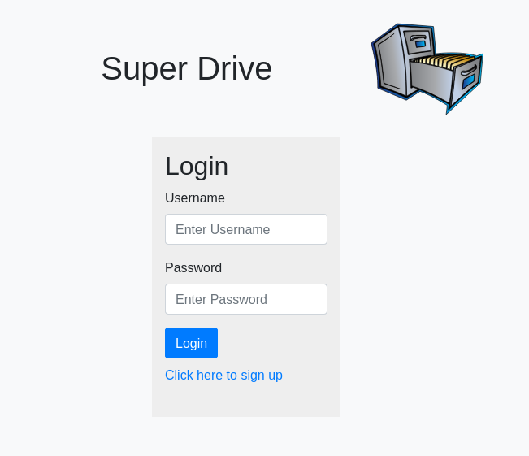

# Super Drive

### GitHub username: antonio36alv

&nbsp;&nbsp;&nbsp;&nbsp;&nbsp;

[Deployed Website](https://super-drive.herokuapp.com/) - Hosted on Heroku which goes into sleep mode if website hasn't been used for 30 minutes, so you may have to give it a bit to come up.

[My GitHub](https://github.com/antonio36alv)

<!-- add main screenshot here -->


<!-- add video demo here -->

## Description

A project that I built as part of my Udacity Java Web Developer course. For specifications/instructions you can find them [here](./Instructions.md) or in the Instructions.md file.
This website is built with Spring Boot and Thymeleaf. It allows a user to store files, notes, and login credentials for other websites. After the project was completed I made some changes
to my liking. The instructions called for an encrypted password to be shown, when viewing all the passwords stored. I changed it to appear as a hidden password (dots instead of alphanumeric characters
and symbols). Then naturally, I added a way for the user to show/hide the password and a button to copy it. I also added a way for when a user returns to the home page (where files, notes and credentials
are stored) the last tab they were on automatically displays.

<!-- - Pages are restricted according to whether or not a user is logged in -->

<!-- TODOs -->
<!-- add main screenshot -->
<!-- add video demo -->
<!-- table of contents, if necessary if necessary -->

## Installions/Requirements

- Java 11+

- Maven

- All the dependencies included within the [pom.xml](./pom.xml) file. IntelliJ is my preferred IDE, which takes care of importing dependencies present in the pom.xml.

To run tests you will also need:

- Geckodriver 

- Firefox

Or if you have docker you can run the GithubActionsTests.java test class. This test class uses Testcontainers, which is a testing library for java. In this case

Testcontainers initilizes a Docker container that runs Selenium Web Driver and Firefox. More about Testcontainers [here](https://www.testcontainers.org/). To run

the GithubActionsTests.java test class through maven cli run ```mvn clean test -Dtest=GithubActionsTests```.
 

### Features

- Spring MVC

- Thymeleaf

- Spring Security

- MySQL

- MyBatis (ORM)

- Credential Storage with password encryption

- User Authentication - passwords are hashed and salted

- Testcontainers - [info](https://www.testcontainers.org/)

- Github Actions Workflow

### Tests

This will work if you have firefox and geckodriver installed on your system.

You can run tests via your IDE or with Maven CLI with:

```mvn clean test -Dtest=CloudStorageApplicationTests```

However, if you have Docker there is a different test class that uses Testcontainers.

You may run this by using Maven CLI as so:

```mvn clean test -Dtest=GithubActionsTests```

This avoids the need to install Firefox and geckodriver wherever you may need to run this.

The test class with Testcontainers was implemented as a means to run this test class in 

Github Actions without needing to install and configure Firefox and geckodriver.


### Github Actions/Workflow

This repository contains a Github Actions workflow that builds and simultaneously runs tests (te test class that uses Testcontainers). Once the build job finishes

(builds successfully and tests pass), this triggers the integration job. The integration job simply creates a pull request and merges it inot master via the Github API,

by using cURL. The only setup needed for this workflow is to set up the Github Personal Access Token in the secrets section of the settings. Instructions on creating a

personal access token can be found [here](https://docs.github.com/en/free-pro-team@latest/github/authenticating-to-github/creating-a-personal-access-token).